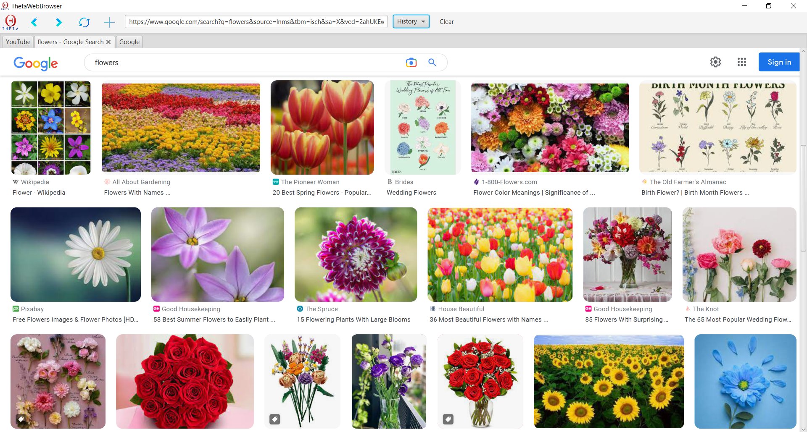

# ThetaWebBrowser

    

  
A simple Web browser implemented by me in JavaFx. It supports Back, Forward and Refresh page functionality.
It also supports search straight into google in the URL bar and browsing history. You can visit any link from
the browsing history. It can handle multiple tabs with each one having a name relative to the website you are viewing.
  

# Notes
- OpenJDK 17.0.5 is required
- javafx.web 16 is required
- IDE used : Intellij Ultimate
- Executable JAR directory : /ThetaBrowser/out/artifacts/ThetaBrowser_jar/
- To export your own JAR : Ctrl+Ctrl and mvn install

